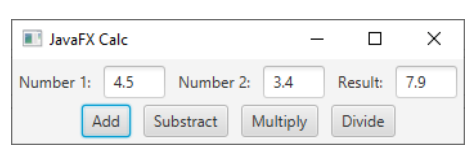
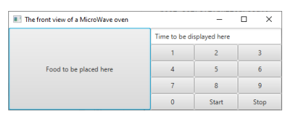
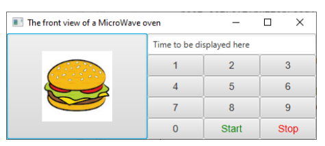

# java-fx calculatrice

## Une introduction à java fx

Dans le cadre d'un cours de programmation à l'epfc

## Enoncé 1

Ecrire une application graphique représentant une petite calculatrice comme présentée ci-dessous. Dans un premier
temps, ne vous occupez pas trop des soucis de mise en page.
Les gestionnaires d'événements de chaque bouton doivent être implémentés à l'aide de classes internes anonymes
ou de lambdas. Essayez les deux.

## Enoncé 2 : four à micro onde

Ecrire une application graphique représentant un four à micro-ondes comme présenté ci-dessous.
Aucun gestionnaire d'événement ne doit être implémenté.

## Enoncé 3 : couleurs, image et police

Tout en cherchant de la documentation, décorez l'application de votre choix, par exemple en changeant la couleur
du texte, la police de caractère et en ajoutant des icônes aux boutons.

